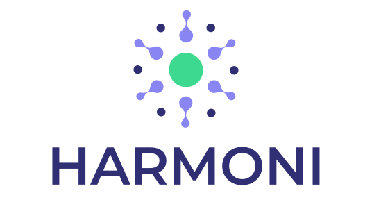

Welcome to HARMONI (Human And Robot Modular OpeN Interactions)! HARMONI is a ROS based tool for creating and controlling human-robot interaction. HARMONI is an open source (MIT License) tool meant to speed up development, collaboration, and experimentation for the HRI community. 

Repository: https://github.com/interaction-lab/HARMONI

Wiki: https://github.com/interaction-lab/HARMONI/wiki

### Setup Instructions

For setup and installation please jumpt to our getting started page [here](https://github.com/interaction-lab/HARMONI/wiki/Getting-started).

# Overview

Human And Robot Modular OpeN Interactions (HARMONI) is a comprehensive tool containing all the components and capabilities you need to quickly get your social interaction up and running on a robot. 

HARMONI packages the additional capabilities needed for social human-robot interaction neatly on top of ROS by wrapping and integrating several state of the art libraries in the domains of natural language understanding, dialog, object and face detection, and decision trees. HARMONI is the glue that integrates these disparate packages on top of ROS in a standardized way so you don't have to. Just [install our docker images](https://github.com/interaction-lab/HARMONI/wiki/Setup) and [configure the capabilities you need](https://github.com/interaction-lab/HARMONI/wiki/Usage) for your interaction.

HARMONI is built to be Robot-Agnostic, Modular, and Composable. By building on top of ROS and wrapping the whole platform in Docker, HARMONI should work on most hardware platforms and operating systems. By keeping to well defined interfaces with loose coupling and encapsulation HARMONI is a modular distributed system. This modularity further enables the system to be composed to suit the user's needs just through configuration files.

# HARMONI Integrations

Most robots need some combination of the abilities to sense, plan, and act. For complex social interactions these abilities can be further disected to the following categories: sense, detect, dialogue, plan, and act. Although it is not the only way to break down a social robot architecture, it is helpful to group the modules in this way. Listed modules have already been integrated with HARMONI and can be used seperately or in place of one another.

## Sense 
Sensing involves reading sensor data, such as audio, video, and depth sensors. Further sensor integrations will be added as needed or can be contributed by the community.

- PyAudio

- OpenCV

## Detect
Detecting involves taking in sensor data and detecting some signal from it. This includes transcribing speech, detecting objects, and detecting faces. Other detectors such as turn-taking, affect, and engagement will be added eventually.

- Wave2Letter

- DLIB

- Google StT

## Dialogue
Dialogue can be integrated with sensing and detecting, but can also stand on its own. Dialogue must be able to take in speech or text and return the appropriate speech or text.

- Amazon Lex

- Google Dialogflow

- Rasa

## Core (Plan and Control)
The core is tightly coupled with all of the other modules as it controls the other modules according to the state. The planner keeps track of the state and directs the other modules to start, stop, or do whatever is needed. HARMONI has its own core modules for planning, divided into a high level decision maker and a lower lavel pattern executor, however it also integrates with the following:

- PyTrees

- Unity

## Act
Actuation includes control of the motors, displays, and displays. 

- Amazon Polly

- Cordial

- PyAudio

## Robots
The following is a growing list of robots that HARMONI has be used on:

- QT

# Call for Contributions
We hope you will enjoy and find use in our project. We always welcome developments on new robots or with modules. To learn more about developing new modules please see [here](https://github.com/interaction-lab/HARMONI/wiki). We also have a backlog of [issues](https://github.com/interaction-lab/HARMONI/issues) and welcome pull requests.

## TODO
- [ ] Add links to integrated modules
- [ ] Test HARMONI on:
    - [ ] Quori
    - [ ] Kiwi
    - [ ] Curie
    - [ ] Blossom
