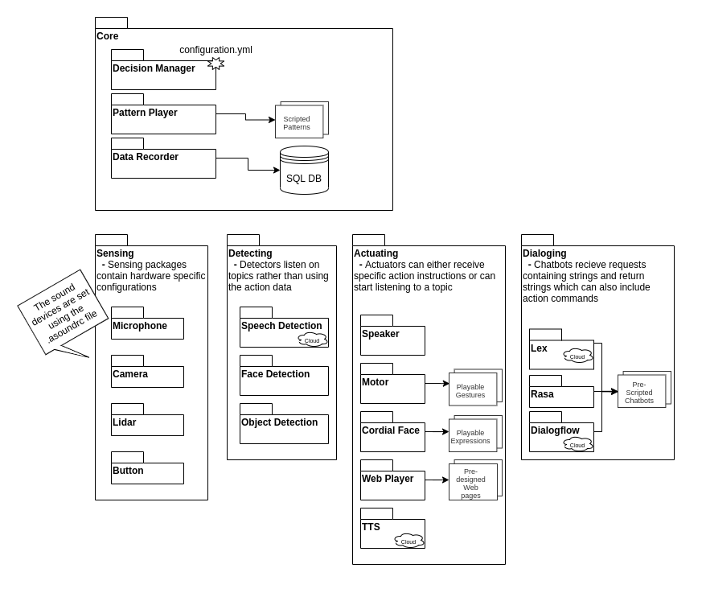
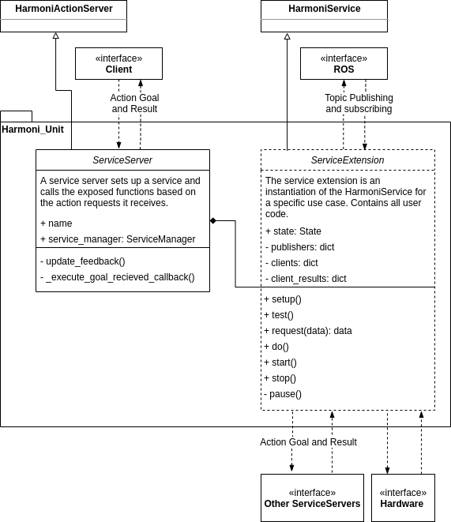

# Architecture

## HARMONI Repository
The HARMONI repository is organized into the following packages, based on the fundamental capabilities needed for human-robot interaction:
  - harmoni_actuators - _controlling hardware (e.g. motors, screens, speakers)_
  - harmoni_core
    - harmoni_common_lib - _defines the Harmoni unit and helper functions_
    - harmoni_common_msgs - _defines harmoni messages and actions_
    - harmoni_decision - _highest level controller, can play patterns or individual units_
    - harmoni_pattern - _middle level decision player, defines sequences or patterns for dialog_
    - harmoni_recorder - _records interactions_
  - harmoni_detectors - _extracting useful information from sensor signals (e.g. transcriptions, facial locations, etc.)_
  - harmoni_dialogues - _processing user speech (text) and return robot speech (text)_
  - harmoni_sensors - _reading physical sensors and publishing sensor streams_

## HARMONI Unit

Nearly everything in HARMONI is a ROS node called a HARMONI unit. The HARMONI unit consists of two classes, a Service Server and a Service Manager, which standardize the interface for a given node as shown above.

The Harmoni Unit standardizes the communication and control interface for each node, allowing other nodes to control a unit with minimal knowledge of the internal workings. 
