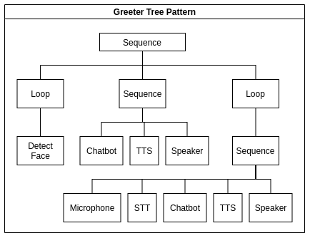

# Compose Interaction

_This example uses the sequential pattern player found in the harmoni_pattern package._



_An example interaction script pictured as a behavior tree._

## Interaction Definition 
HARMONI enables to compose an interaction very easily. The interaction consists of different steps, that can be ran all together, or they can wait for another action to accomplish.

### Template

Below is a template for all possible interaction definitions. It is not valid JSON until you choose one of the options in each group (X, Y, Z) of items and remove comments. See [the example](#example) in the next subsection to see what a full interaction would look like.

```javascript
[{"set": string (sequence, loop), 
  "steps": array
      [
        {$step: ($step = name of the action, e.g. bot_default)
            {"action_goal": string ("REQUEST", "DO", "START", "STOP"), 
             "resource_type": string ("service", "actuator", "sensor", "detector"),
             "wait_for": string ("" --> empty if the next step does not wait for current action result for starting, "new"--> next action wait until the current action return a result),
             "trigger": string (trigger input for the current action)
             }
        },
        [ if you want to run steps in parallel, add them into an array
            {$step: ($step = name of the action, e.g. bot_default)
              {"action_goal": string ("REQUEST", "DO", "START", "STOP"), 
               "resource_type": string ("service", "actuator", "sensor", "detector"),
               "wait_for": string ("" --> empty if the next step does not wait for current action result for starting, "new"--> next action wait until the current action return a result),
               "trigger": string (trigger input for the current action)
             }
            },
            {$step: ($step = name of the action, e.g. bot_default)
              {"action_goal": string ("REQUEST", "DO", "START", "STOP"), 
               "resource_type": string ("service", "actuator", "sensor", "detector"),
               "wait_for": string ("" --> empty if the next step does not wait for current action result for starting, "new"--> next action wait until the current action return a result),
               "trigger": string (trigger input for the current action)
             }
            }
        ]
      ]
  }
]
```
The `set` of interaction can be: "sequence" or "loop".
The `steps` field contains the array of the module that you want to run in sequence, or in parallel (if you add the modules into another array). Each `steps` is then defined into an array of dict which refer to different `action`.
Each `action` has the name of the module  (e.g., bot, tts, face_mouth, speaker) plus the id that you find in the `/HARMONI/harmoni_core/harmoni_decision/config/configuration.yaml`(e.g., default, micol).
The name is: \$MODULENAME + "_" + \$MODULEID.
If the actions should start in parallel, you need to insert them into an array.
Each action contains the following fields:
- action_goal: enum (DO, REQUEST, START, STOP)
- resource_type: string (actuator, detector, sensor)
- wait_for: string (new: if you are waiting for the results of the previous module to start the action)

### Example

For example, the _demo.json_ example is the following:

```json
[{"set": "sequence", 
  "steps": 
      [
        {"bot_default": 
           {"action_goal": "REQUEST", "resource_type": "service", "wait_for": "new", "trigger": "hey"}}, 
        {"tts_default": 
           {"action_goal": "REQUEST", "resource_type": "service", "wait_for": "new"}}, 
        [
         {"speaker_default": 
           {"action_goal": "DO", "resource_type": "actuator", "wait_for": "new"}}
        ],
        {
            "web_default": {
                "action_goal": "REQUEST",
                "resource_type": "service",
                "wait_for": "new",
                "trigger": "[{'component_id':'container_2', 'set_content':''}]"
            }
        }
   ]
  }
]
```
In this example, we want to run in sequence (`"set": "sequence"`) the following steps:
- Send a request (`"action_goal": "REQUEST"`) with message "hey" (`"trigger": "hey"`) to an external service AWS Lex (`"resource_type": "service"`) and wait for the response (`"wait_for": "new"`) with the action `bot_default`
- Once we get the result from `bot_default`, we send a request (`"action_goal": "REQUEST"`) (with message equal to the result received) to an external service AWS Polly (`"resource_type": "service"`) and wait for the response (`"wait_for": "new"`) with the action `tts_default`,
- Once we get the result from `tts_default`, we want to send a do command (`"action_goal": "DO"`) to the actuator speaker (`"resource_type": "actuator"`) in parallel (in the array):
     1. the audio synthesized file with `speaker_default` and wait for its response before running the following step(`"wait_for": "new"`)
- The last step will consist of displaying the input text bot in the browser, sending a do command (`"action_goal": "DO"`) to the actuator (`"resource_type": "actuator"`) named as `web_default`.

At this point you can interact with the robot through the chat in the browser.

## Modify an interaction
To compose or modify an interaction, you only need to add a new action into the `HARMONI/harmoni_core/harmoni_pattern/pattern_scripting/demo.json` file. 
You can use your preferred text editor (for example, we use VSCode here) for editing the json file on your host machine. 
In your terminal run: `code` or whatever editor you prefer to edit the json file.
For example, if you need to add the gesture (which is an actuator) of the robot in parallel with the speaker for seeing the robot movements you should send a command. Add the following in `demo.json`:


```json
[{"set": "sequence", 
  "steps": 
      [
        {"bot_default": 
           {"action_goal": "REQUEST", "resource_type": "service", "wait_for": "new", "trigger": "hey"}}, 
        {"tts_default": 
           {"action_goal": "REQUEST", "resource_type": "service", "wait_for": "new"}}, 
        [
         {"gesture_default": 
           {"action_goal": "DO", "resource_type": "actuator", "wait_for": ""}}, 
         {"speaker_default": 
           {"action_goal": "DO", "resource_type": "actuator", "wait_for": "new"}}
        ],
        {
            "web_default": {
                "action_goal": "REQUEST",
                "resource_type": "service",
                "wait_for": "new",
                "trigger": "[{'component_id':'container_2', 'set_content':''}]"
            }
        }
       ]
  }
]
```
When you modified it, you can test it exiting the rldemo (ctrl-c), and re-running it with the command:
`rldemo`
If you have killed also `rlharmoniservices` and `rlhardwareservices`, rerun them as well.